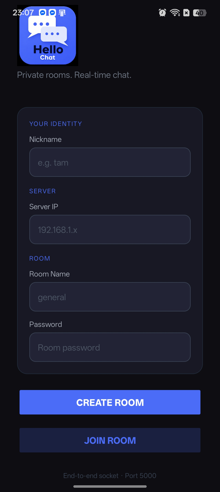
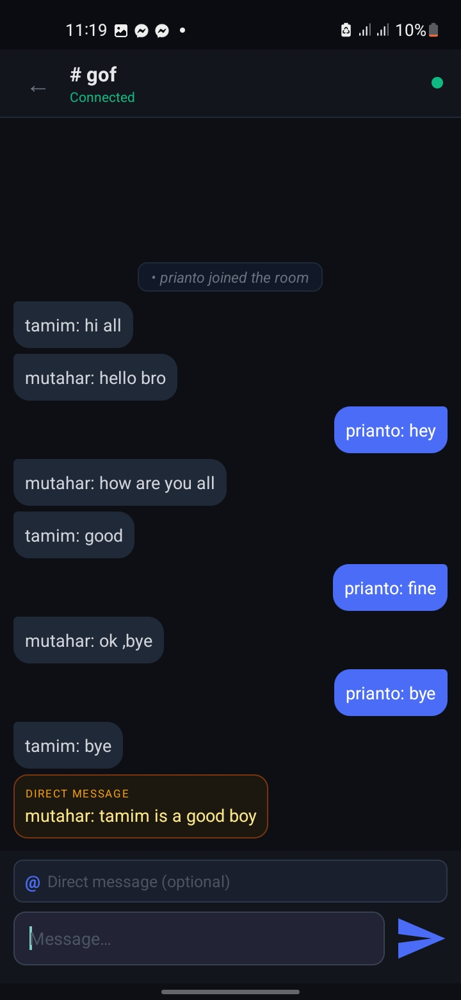
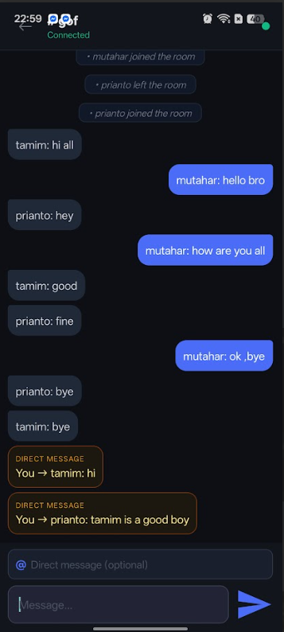

# 📱 IP-Based Chat System (Python + Android)

## 🧠 Project Overview

This project is a **real-time IP-based chat system** built using:

* **Python (Socket Programming)** → Server
* **Android (Java + XML UI)** → Client

It supports both:

* 👥 **One-to-Many (Group Chat)**
* 💬 **One-to-One (Private Messaging)**

---

## ✨ Features

* 🔗 IP-based communication over LAN/Wi-Fi
* 🏠 Create & Join chat rooms
* 🔐 Password-protected rooms
* 💬 Real-time messaging
* 👤 Nickname-based identity
* 📩 Private (Direct) Messaging
* 👥 Show online users
* ⚡ Multi-threaded Python server
* 🎨 Clean & modern Android UI

---

## 📸 Screenshots

### 🔐 Login / Room Creation



### 💬 Group Chat



### 📩 Private Messaging



---

## 🏗️ Architecture

```text
Android Clients (Multiple Users)
        ↓
   Wi-Fi / LAN
        ↓
Python Socket Server (Port 5000)
```

---

## ⚙️ How It Works

1. Python server runs on a laptop
2. Android devices connect using **IP address**
3. Users:

   * Create or join a room
   * Send messages
   * Chat in real-time

---

## 🚀 Setup Instructions

### 🖥️ 1. Run Python Server

```bash
python server.py
```

Output:

```text
Server running on port 5000...
```

---

### 🌐 2. Find Server IP

```bash
ipconfig
```

Example:

```text
IPv4 Address: 192.168.0.106
```

---

### 📱 3. Connect Android App

Enter:

```text
Server IP: 192.168.0.106
Nickname: Your Name
Room: Any name
Password: Optional
```

---

### 📶 4. Important

All devices must be on the **same Wi-Fi network**

---

## 🧪 Demo

### 👥 Group Chat

* Leave DM field empty
* Message is sent to everyone

### 📩 Private Chat

* Enter nickname in DM field
* Message goes to only that user

---

## 🧰 Tech Stack

* Python (socket, threading, JSON)
* Java (Android)
* XML UI (Material Design)
* RecyclerView (Chat UI)

---

## 📁 Project Structure

```text
ChatSystem/
│
├── server.py
│
└── android_app/
    ├── MainActivity.java
    ├── ChatActivity.java
    ├── SocketManager.java
    ├── MessageAdapter.java
    │
    └── res/
        ├── layout/
        ├── drawable/
        └── values/
```

---

## ⚠️ Common Issues

### ❌ Cannot connect

* Check same Wi-Fi
* Check IP is correct

### 🔥 Firewall issue

Allow Python in Windows Firewall

---

## 🎯 Future Improvements

* 🔒 End-to-end encryption
* 🧑‍🤝‍🧑 User authentication
* 🌐 Internet-based chat
* 📦 Database storage
* 🎨 Advanced UI (avatars, typing indicator)

---

## 👨‍💻 Author

**Prianto Chandra Dey**

---

## 🏁 Final Note

This project demonstrates:

* Socket programming
* Client-server architecture
* Real-time communication
* Android UI/UX design

---
